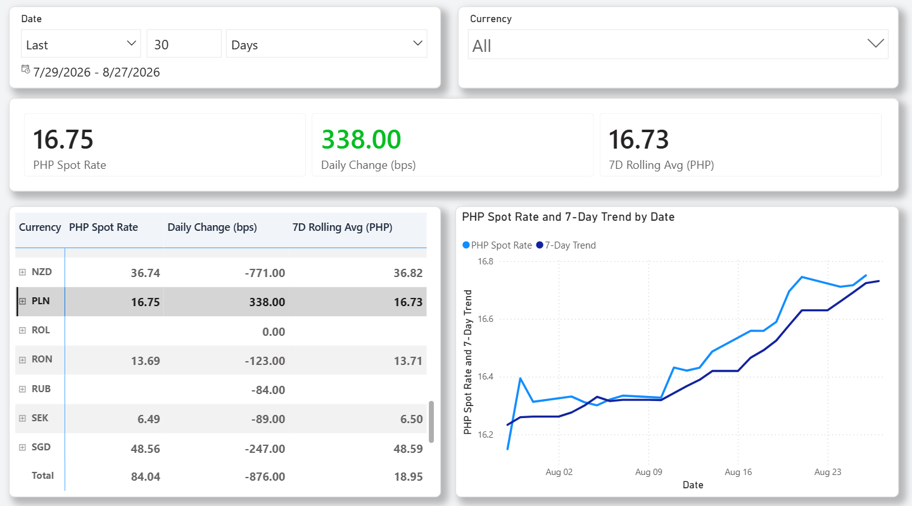
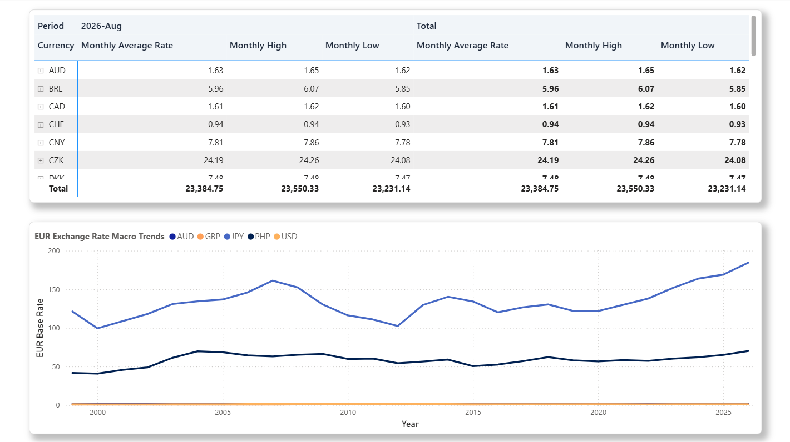
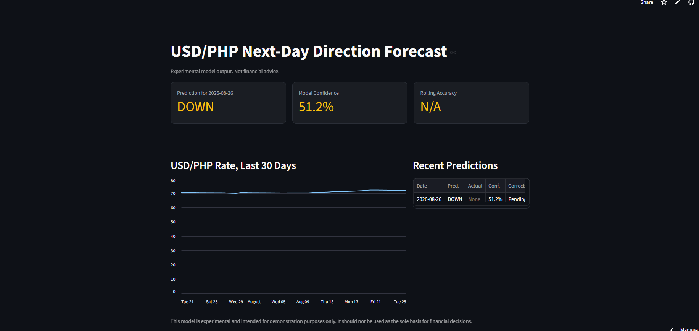
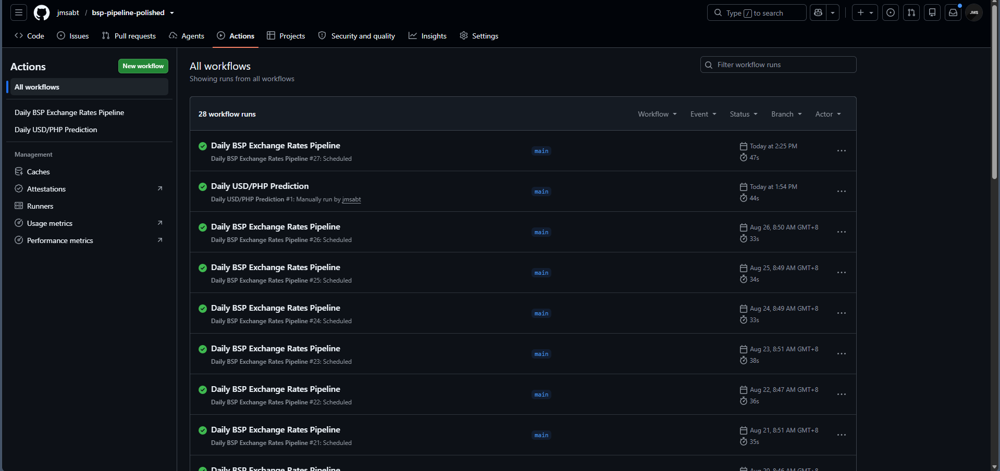

# Automated BSP Exchange Rates Medallion Pipeline 💱

An automated cloud pipeline that pulls daily PHP exchange rates, stores them, models them and visualizes trends. Built to practice real data engineering beyond local scripts. This means cloud storage, cloud databases, scheduled orchestration, and a machine learning layer for next-day direction forecasting.


---

## 📖 Overview

This pipeline pulls live PHP exchange rate data from a public API on a daily schedule. No manual steps are needed. It applies a Bronze/Silver/Gold architecture, layers a machine learning forecasting component on top, and publishes two live public dashboards. Compared to a purely local project, this one adds real cloud storage, a cloud database, unattended orchestration, and a supervised learning experiment with honest, documented results.

**This project demonstrates:**

- Scheduled automation with GitHub Actions, no server to maintain
- Cloud object storage and cloud Postgres
- Idempotent loading, safe to re-run without duplicates
- Secrets management through CI secrets and Streamlit Cloud secrets
- Medallion architecture on a cloud-native stack
- Time-aware feature engineering and supervised classification
- Model evaluation against a naive baseline, avoiding data leakage
- A lightweight, always-on prediction dashboard separate from the BI layer

---

## 🏗️ Data Architecture


```
Frankfurter API (BSP reference rates)
        |
        v  extract.py
Raw JSON --> Supabase Storage (Bronze, date-partitioned)
        |
        v  load.py
silver_rates (Postgres)
        |
        v
gold_daily_rate_changes, gold_monthly_currency_summary,
gold_cross_rates_php, gold_monthly_exchange_rate_php  (views)
        |
        +----------------------------+
        v                            v
Power BI dashboard              ml/features.py
(historical analytics,          (feature engineering)
 published, public link)               |
                                        v
                                 ml/train.py
                                 (Logistic Regression vs
                                  naive baseline vs Random Forest)
                                        |
                                        v
                                 ml/predict.py
                                 (daily prediction + actuals backfill)
                                        |
                                        v
                                 ml_predictions (Postgres)
                                        |
                                        v
                                 Streamlit dashboard
                                 (next-day USD/PHP forecast, live)

GitHub Actions runs ingestion and prediction daily.
```

1. **Bronze Layer**: Unmodified raw JSON from the API. Written to Supabase Storage and partitioned by date.
2. **Silver Layer**: Cleaned exchange rate records loaded into Postgres. Uses idempotent upserts and automated currency dimension seeding.
3. **Gold Layer**: Four analytical views covering daily changes, monthly summaries, PHP cross rates, and PHP-specific trend flags.
4. **ML Layer**: A supervised classification model predicting next-day USD/PHP direction, trained on time-based splits, evaluated against a naive baseline.
5. **Serving Layer**: Power BI for historical analytics, Streamlit for the live daily forecast.

---

## 🛠️ Tech Stack & Rationale

| Layer                 | Tool                              | Why                                                               |
| --------------------- | --------------------------------- | ----------------------------------------------------------------- |
| Source                | Frankfurter API                   | Free and no auth needed                                           |
| Extract               | Python (`requests`)               | Simple HTTP pull                                                  |
| Raw storage           | Supabase Storage                  | Object storage for raw JSON, partitioned by date                  |
| Transform and Load    | Python (`pandas`, `sqlalchemy`)   | Cleans and loads data into Postgres                               |
| Warehouse             | Supabase (Postgres)               | Silver table plus four Gold views                                 |
| Orchestration         | GitHub Actions                    | Free daily scheduling with no server                              |
| Historical dashboard  | Power BI                          | Public dashboard with no login, built for BI-style analysis       |
| ML training/inference | Python (`scikit-learn`, `joblib`) | Naive baseline, Logistic Regression, Random Forest                |
| Prediction storage    | Supabase (Postgres)               | `ml_predictions` table, one row per forecast day                  |
| Forecast dashboard    | Streamlit Community Cloud         | Free, always-on, no gateway needed, same language as the ML layer |

---

## 📸 Screenshots

<!-- Keep this to 2-4 images in docs/screenshots/. Priority: the live dashboards first, then a successful GitHub Actions run, then a sample Gold query result. -->

### Historical analytics dashboard




### Next-day forecast dashboard



### Scheduled pipeline run



---

## 📂 Repository Structure

```
bsp-exchange-rate-pipeline/
│
├── src/
│   ├── extract.py
│   └── load.py
├── ml/
│   ├── features.py
│   ├── train.py
│   ├── predict.py
│   ├── model.pkl
│   └── scaler.pkl
├── .streamlit/
│   └── config.toml
├── streamlit_app.py
├── docs/
│   ├── architecture_diagram.png
│   └── screenshots/
├── .github/workflows/
│   ├── daily_extract_load.yml
│   └── daily_predict.yml
├── .env.example
├── README.md
└── requirements.txt
```

---

## 🚀 Getting Started

### Prerequisites

- A Supabase project with a Storage bucket and Postgres database
- A GitHub repo with secrets set under Settings, Secrets and variables, Actions
- A Streamlit Community Cloud account, with secrets set under app Settings, Secrets
- See `.env.example` for required variables

### Setup

```bash
git clone <repo>
cp .env.example .env
pip install -r requirements.txt

# Ingestion
python src/extract.py
python src/load.py

# ML training (run once, or whenever features change)
python ml/train.py

# Daily prediction (this is what GitHub Actions runs automatically)
python ml/predict.py

# Local dashboard preview
streamlit run streamlit_app.py
```

Both GitHub Actions workflows run automatically once secrets are set: one for ingestion, one for daily prediction.

---

## 🎯 Key Technical Decisions

- **Idempotent upserts over blind inserts.** A re-run never creates duplicate rows.
- **Bronze stored as raw JSON, not directly in Postgres.** This preserves the original response for reprocessing.
- **GitHub Actions over a dedicated orchestrator.** A single daily job does not need Airflow's DAG machinery.
- **Gold views instead of materialized tables.** Fast enough at this data volume and skips a refresh step.
- **Two dashboards, not one.** Power BI suits multi-page historical analysis. Streamlit suits a single always-on prediction view without a data gateway, since Postgres refresh in Power BI Service would otherwise require one.
- **Time-based train/test split, not random shuffling.** Training only ever sees the past, preventing lookahead bias common in naive ML setups on time series data.
- **A naive baseline was scoped in from the start**, not added after the fact, so model performance had something honest to be measured against.

---

## 🤖 Machine Learning: Next-Day USD/PHP Direction Forecast

### Objective

Predict whether USD/PHP will move UP or DOWN the next trading day, using only features derivable from historical BSP rate data at the time of prediction.

### Features

`prior_day_rate`, `pct_daily_change`, `rolling_7d_avg`, `day_of_week`, `distance_from_7d_avg`

### Models compared

| Model               | Test Accuracy |
| ------------------- | ------------- |
| Naive baseline      | 49.0%         |
| Logistic Regression | 49.6% – 49.9% |
| Random Forest       | 50.8%         |

_Test period: 2024-01-01 onward. Training period: 2010-01-01 to 2023-12-31._

### Finding

All three approaches, a naive rule, a linear model, and a tree-based ensemble, scored within a narrow band close to 50% accuracy. This indicates that short-term price and volatility features alone do not carry meaningful predictive signal for next-day FX direction. This result is consistent with the efficient-market behavior generally expected of short-term currency movements, and is reported here as the honest outcome of the experiment rather than adjusted or hidden.

The deployed model is Logistic Regression, chosen for simplicity and interpretability over Random Forest, since the accuracy gap between them was not statistically meaningful at this sample size.

### What this demonstrates, regardless of accuracy

- Real-world feature engineering with no lookahead leakage
- A defensible time-based validation methodology
- Honest comparison against a baseline, including a negative result
- A full production loop: training, daily inference, actuals backfill, and serving

### Possible next steps

- Walk-forward validation instead of a single train/test split
- Additional predictors: interest rate differentials, inflation data, or other currency pairs
- Extending beyond USD/PHP to other BSP-tracked pairs

The dashboard and this README both label the forecast as experimental. It is not intended as financial advice.

---

## 📊 Results / Metrics

- **260,000+** historical exchange rate records processed and backfilled
- **4** analytical Gold views delivered
- **3** models trained and evaluated against a documented baseline
- Automated daily execution of ingestion and forecasting, both scheduled independently
- Two live public dashboards, one BI-style, one ML-forecast-focused

---

## 🔗 Live Dashboard

- Streamlit (next-day forecast): https://bsp-fx-forecast.streamlit.app/

---

## 🧰 Skills Demonstrated

`Python` `REST APIs` `Supabase` `PostgreSQL` `Cloud Object Storage` `GitHub Actions` `CI/CD` `Medallion Architecture` `Idempotent ETL` `Secrets Management` `Power BI` `scikit-learn` `Time-Series Feature Engineering` `Supervised Classification` `Model Evaluation` `Streamlit` `Data Leakage Prevention`
